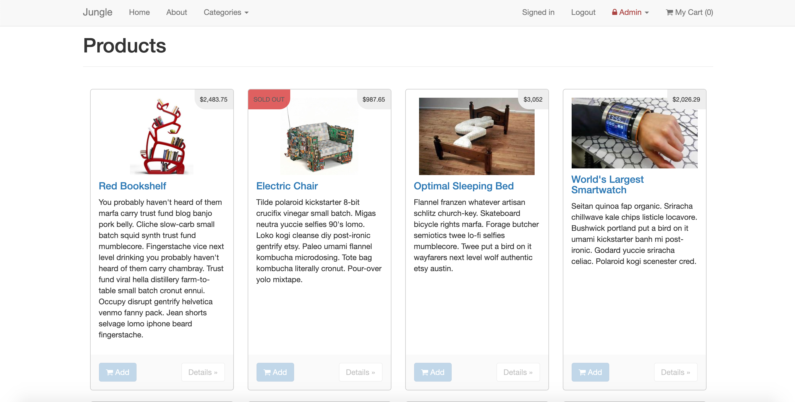
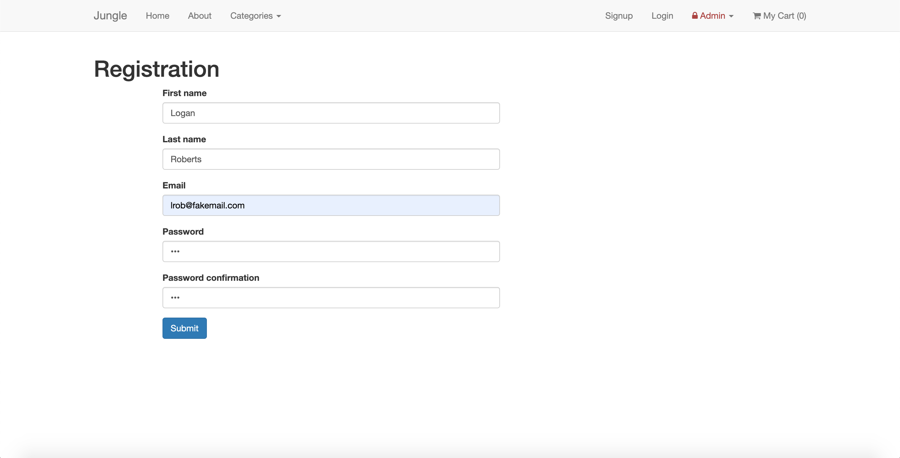
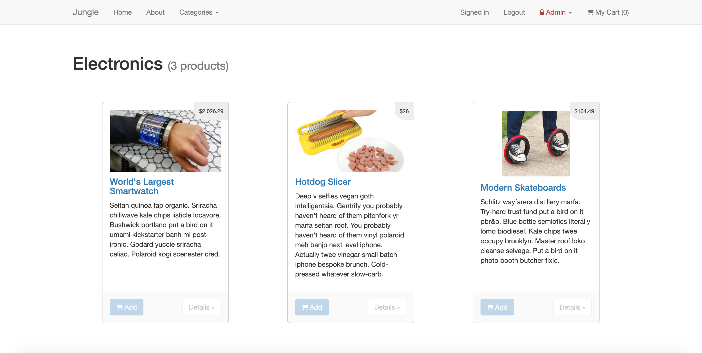
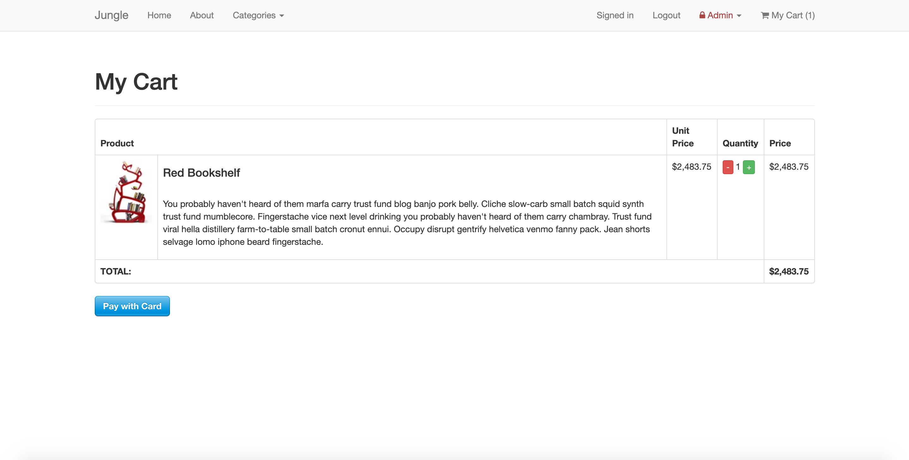
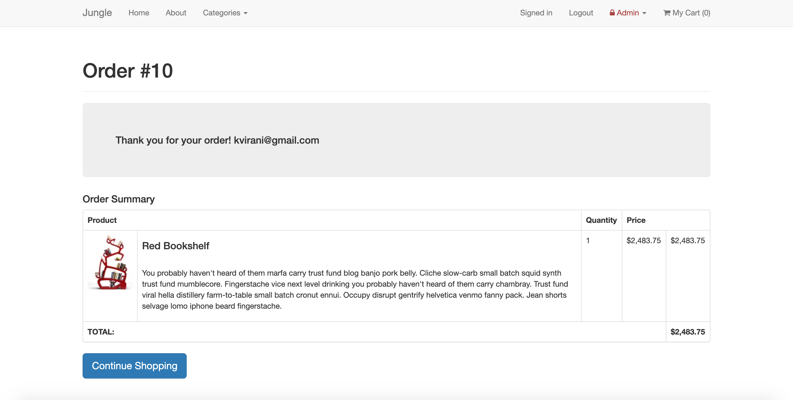
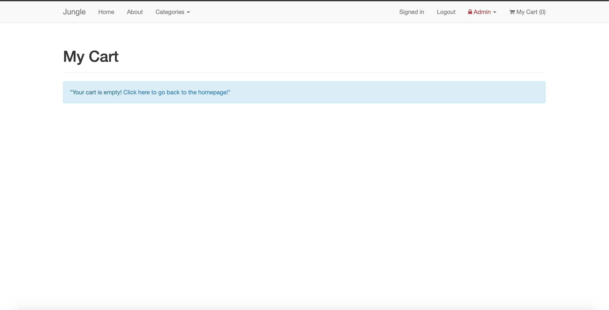

# Jungle

A mini e-commerce application built with Rails 4.2 for purposes of teaching Rails by example.

## Setup

1. Run `bundle install` to install dependencies
2. Create `config/database.yml` by copying `config/database.example.yml`
3. Create `config/secrets.yml` by copying `config/secrets.example.yml`
4. Run `bin/rake db:reset` to create, load and seed db
5. Create .env file based on .env.example
6. Sign up for a Stripe account
7. Put Stripe (test) keys into appropriate .env vars
8. Run `bin/rails s -b 0.0.0.0` to start the server

## Stripe Testing

Use Credit Card # 4111 1111 1111 1111 for testing success scenarios.

More information in their docs: <https://stripe.com/docs/testing#cards>

## Dependencies

* Rails 4.2 [Rails Guide](http://guides.rubyonrails.org/v4.2/)
* PostgreSQL 9.x
* Stripe

## Usage
Main Page will show all products and if they are sold out it will notify you.

You should be able to register and will be automatically signed in with your new account.

You can browse through individual categories and view products in that category.

Add items to cart and have it update the quantity.

Review your order and purchase the products. Gives an order total.

If the cart is empty it will show that you need to add items to cart and link you to the home page.
